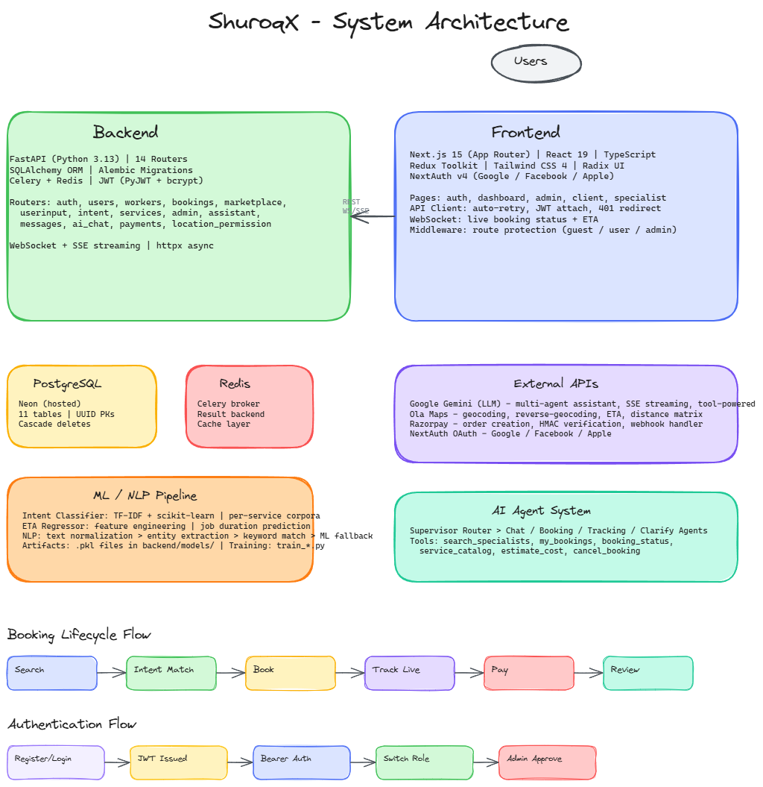

# ShuroqX — AI-Powered Service Marketplace

> An end-to-end marketplace platform that uses natural-language intent to match customers with verified home-service specialists, predicts job duration, tracks live worker location, and handles the full booking lifecycle — powered by Google Gemini.



> Editable source: [`docs/architecture.excalidraw`](docs/architecture.excalidraw)

---

## What is ShuroqX?

ShuroqX is a two-sided service marketplace. A customer describes what they need in plain English ("my kitchen sink is leaking"), the platform classifies the intent, suggests the right specialist category, ranks nearby workers by skill match + rating + predicted ETA, and lets the customer book, track, and review the job — all in one flow.

Workers (called *Specialists*) register, list their skills/services, get admin-approved, and receive job requests. They can update availability, view their earnings, and accept/reject incoming bookings. Admins review specialist applications, approve new service categories, and monitor platform stats.

### Key features

- **Natural-language query processing** — free text is classified into service intent using a trained ML classifier (TF-IDF + scikit-learn), and matched specialists are returned.
- **AI Conversational Assistant** — a multi-agent LLM powered by **Google Gemini** that can search specialists, check bookings, estimate costs, and even cancel appointments through natural conversation.
- **Marketplace search** — ranked specialists based on query intent, worker services, and reviews.
- **ETA prediction** — trained regression model estimates job duration based on service type and context features.
- **Booking lifecycle** — create → status updates (pending / accepted / in_progress / completed / cancelled) → review. Full WebSocket channel for live updates.
- **Real-time tracking** — workers share location during active bookings; live ETA recomputed via Ola Maps.
- **Dual-role accounts** — any user can switch between *customer* and *specialist* without re-registering.
- **Razorpay payments** — secure order creation, HMAC signature verification, and webhook handling.
- **Admin dashboard** — specialist approval queue, skill submission approvals, platform stats, user management.
- **JWT auth** — register/login returns access tokens; profile management, password change, account deletion.
- **Person-to-person messaging** — real-time chat between specialist and client, scoped to a booking.
- **Address book** — saved addresses with a default; reuse across bookings.

---

## Tech stack

| Layer | Technology |
|-------|-----------|
| **Backend** | Python 3.13, FastAPI, SQLAlchemy, PostgreSQL (Neon), Alembic, Celery + Redis |
| **Frontend** | Next.js 15 (App Router), React 19, TypeScript, Redux Toolkit, Tailwind CSS 4 |
| **AI/LLM** | Google Gemini (via Google Generative Language API), scikit-learn (TF-IDF classifier + ETA regressor) |
| **Auth** | JWT (PyJWT + bcrypt), NextAuth v4 (Google, Facebook, Apple OAuth) |
| **Payments** | Razorpay (order creation, HMAC verification, webhooks) |
| **Maps/Geo** | Ola Maps API (geocoding, reverse-geocoding, ETA, distance matrix) |
| **Real-time** | WebSockets (FastAPI native), Server-Sent Events (SSE) for AI streaming |
| **UI** | Radix UI, Framer Motion, GSAP, visx (charts), Lucide icons |

---

## Project layout

```
shuroqx-Redesign/
├── backend/
│   ├── main.py                  # FastAPI entry point, mounts all routers
│   ├── dbmodels.py              # SQLAlchemy models (User, Worker, Booking, ...)
│   ├── auth_utils.py            # JWT + bcrypt helpers
│   ├── database.py              # Engine + session factory
│   ├── routers/                 # 14 route modules (see API surface below)
│   ├── services/                # Domain logic — NLP, worker matching, ETA, LLM client
│   ├── agents/                  # Multi-agent AI system (supervisor + tools)
│   ├── tasks/                   # Celery background tasks
│   ├── models/                  # Trained .pkl artifacts + metadata
│   ├── datasets/                # Training data (per-service .txt + eta_training_data.csv)
│   ├── alembic/                 # DB migrations
│   └── requirements.txt
│
├── frontend/
│   ├── app/                     # Next.js App Router pages
│   ├── components/              # UI components (auth, admin, dashboard, maps, etc.)
│   ├── hooks/                   # useAuth, useMode, useAdmin, useProfileGuard
│   ├── store/                   # Redux store (authSlice, adminSlice)
│   ├── lib/                     # API client, auth helpers
│   ├── types/                   # Shared TypeScript types
│   ├── public/                  # Static assets
│   ├── next.config.ts           # /api/backend rewrite → localhost:8001
│   └── package.json
│
└── README.md
```

---

## Quick start

### Prerequisites

- Python 3.13+
- Node.js 20+
- PostgreSQL (or use the included `.env` to point at your instance)
- Redis (for Celery)

### 1. Backend

```bash
cd backend
python -m venv venv
source venv/bin/activate   # Windows: venv\Scripts\activate
pip install -r requirements.txt

# configure environment
cp .env.example .env   # then edit DB/Redis URLs, JWT secret, API keys

# run migrations
alembic upgrade head

# (optional) seed sample services
python seed_services.py

# start API
uvicorn main:app --host 0.0.0.0 --port 8001
```

API is now at `http://localhost:8001` — Swagger docs at `/docs`.

### 2. Frontend

```bash
cd frontend
npm install
npm run dev
```

Frontend is now at `http://localhost:3000`.

The Next.js rewrite in `frontend/next.config.ts` proxies `/api/backend/*` → `http://localhost:8001/*`, so the browser can call `/api/backend/users/register` and the request hits the FastAPI server transparently.

---

## Environment variables

### Backend (`backend/.env`)

| Variable | Required | Description |
|----------|----------|-------------|
| `DATABASE_URL` | Yes | PostgreSQL connection string |
| `JWT_SECRET` | Yes | Secret key for JWT signing |
| `OLA_MAPS_API_KEY` | Yes | Ola Maps API key for geo/ETA |
| `REDIS_URL` | Yes | Redis URL for Celery |
| `CORS_ORIGINS` | No | Comma-separated allowed origins (default: `*`) |
| `RAZORPAY_KEY_ID` | For payments | Razorpay key |
| `RAZORPAY_KEY_SECRET` | For payments | Razorpay secret |
| `RAZORPAY_WEBHOOK_SECRET` | For payments | Webhook verification secret |
| `PRIMARY_API_KEY` | For AI | OpenAI-compatible API key |
| `PRIMARY_BASE_URL` | For AI | OpenAI-compatible base URL |
| `PRIMARY_MODEL` | For AI | OpenAI-compatible model name |
| `FALLBACK_API_KEY` | For AI | Google Gemini API key |
| `FALLBACK_MODEL` | For AI | Gemini model name |

### Frontend (`frontend/.env.local`)

| Variable | Required | Description |
|----------|----------|-------------|
| `NEXT_PUBLIC_API_URL` | Yes | Backend URL (default: `http://localhost:8001`) |
| `NEXT_PUBLIC_WS_URL` | Yes | WebSocket URL |
| `NEXTAUTH_URL` | Yes | NextAuth callback URL |
| `NEXTAUTH_SECRET` | Yes | NextAuth encryption secret |
| `GOOGLE_CLIENT_ID` | For OAuth | Google OAuth client ID |
| `GOOGLE_CLIENT_SECRET` | For OAuth | Google OAuth client secret |
| `FACEBOOK_CLIENT_ID` | For OAuth | Facebook OAuth client ID |
| `FACEBOOK_CLIENT_SECRET` | For OAuth | Facebook OAuth client secret |
| `APPLE_CLIENT_ID` | For OAuth | Apple OAuth client ID |
| `APPLE_CLIENT_SECRET` | For OAuth | Apple OAuth client secret |

---

## Auth model

| Endpoint | Auth required |
|----------|--------------|
| `POST /users/register` | No |
| `POST /users/login` | No |
| `POST /users/oauth-login` | No |
| `GET  /users/me` | Yes (Bearer) |
| `POST /bookings` | Yes (Bearer) |
| `/admin/*` | Yes (Bearer, admin role) |

Both `/users/register` and `/users/login` return `{ access_token, token_type: "bearer", user }`. Send the token as `Authorization: Bearer <token>` on subsequent requests.

---

## AI / ML pipeline

### NLP Intent Classification

Text normalization → entity extraction → keyword/synonym matching (fast, deterministic) → ML model fallback (TF-IDF + scikit-learn). Confidence thresholding ensures ambiguous queries get clarified.

### ETA Prediction

Trained regression model (`backend/models/eta_model.pkl`) predicts job duration from service type and context features.

### Conversational AI Assistant (Google Gemini)

A multi-agent system where a **Supervisor** routes each user message to one of three agents:

| Agent | Responsibility |
|-------|---------------|
| **Chat Agent** | General conversation about the platform |
| **Booking Agent** | Search specialists, show matches, facilitate booking |
| **Tracking Agent** | Answer questions about existing booking status |

The assistant has real tool powers:
- `search_specialists` — find verified, available specialists for a service
- `my_bookings` — return the customer's active/upcoming bookings
- `booking_status` — return live status of a specific booking
- `service_catalog` — list all service categories
- `estimate_cost` — provide price + ETA estimates
- `cancel_booking` — cancel an upcoming booking

Output is streamed via Server-Sent Events (SSE).

### Retrain models

```bash
cd backend
python train_model.py        # intent classifier
python train_eta_model.py    # ETA regressor
```

---

## API surface (quick reference)

```
POST   /users/register
POST   /users/login
POST   /users/oauth-login
POST   /users/switch-to-specialist
GET    /users/me
PUT    /users/me
POST   /users/change-password
DELETE /users/me

POST   /workers
GET    /workers
GET    /workers/{id}
GET    /workers/by-user/{user_id}
POST   /workers/{id}/services
PATCH  /workers/{id}/availability
GET    /workers/{id}/bookings
GET    /workers/{id}/reviews
GET    /workers/{id}/active-booking
GET    /workers/{id}/earnings

POST   /bookings
PATCH  /bookings/{id}/status
POST   /bookings/{id}/review
WS     /ws/bookings/{id}
GET    /bookings/{id}
GET    /users/{user_id}/bookings

POST   /marketplace/search
POST   /userinput/user-query
GET    /intent/user-intent/{query_id}
GET    /services

POST   /assistant/chat

GET    /admin/specialists
GET    /admin/specialists/{id}
PATCH  /admin/specialists/{id}/approve
PATCH  /admin/specialists/{id}/reject
GET    /admin/pending-skills
PATCH  /admin/skills/{worker_id}/{service_id}/approve
PATCH  /admin/skills/{worker_id}/{service_id}/reject
GET    /admin/stats
GET    /admin/users
```

Full OpenAPI schema at `http://localhost:8001/docs` when the backend is running.

---

## Important ports

| Service | Port | Notes |
|---------|------|-------|
| Frontend | 3000 | Next.js dev server |
| Backend | 8001 | FastAPI / uvicorn |
| PostgreSQL | 5432 | Database |
| Redis | 6379 | Celery broker |

---

## License

Internal project — see owner for licensing terms.
